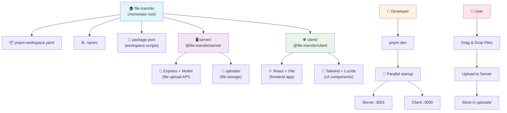

# 文件传输系统

一个基于 Node.js 和 React 的现代化文件传输系统，使用 pnpm workspace 管理的 monorepo 架构。

## 功能特性

- 🚀 Node.js + Express 服务端
- ⚛️ React + Vite 客户端
- 📁 拖拽文件上传
- 💾 本地文件存储
- 🎨 现代化用户界面
- 📦 pnpm workspace monorepo 架构
- 🌏 中文文件名支持
- 🔧 动态服务器地址配置

## 技术栈

- **包管理器**: pnpm (workspace)
- **服务端**: Node.js, Express, Multer
- **客户端**: React, Vite, Tailwind CSS, Lucide React
- **开发工具**: nodemon, ESLint

## 项目结构

```
file-transfer/                    # Monorepo 根目录
├── pnpm-workspace.yaml          # pnpm workspace 配置
├── .npmrc                       # pnpm 配置
├── server/                      # @file-transfer/server
│   ├── src/
│   │   └── index.js            # Express 服务器
│   ├── uploads/                # 文件存储目录
│   └── package.json
├── client/                     # @file-transfer/client
│   ├── src/
│   │   ├── components/         # React 组件
│   │   ├── App.jsx
│   │   └── main.jsx
│   ├── public/
│   └── package.json
└── package.json               # 根目录配置
```

## 结构图


## 快速开始

### 前置要求
- Node.js >= 18.0.0
- pnpm >= 8.0.0

### 安装依赖
```bash
pnpm install
```

### 开发模式
同时启动服务端和客户端：
```bash
pnpm dev
```

### 单独运行
启动服务端：
```bash
pnpm dev:server
```

启动客户端：
```bash
pnpm dev:client
```

### 构建生产版本
```bash
pnpm build
```

### 其他命令
清理所有构建产物：
```bash
pnpm clean
```

运行 linting：
```bash
pnpm lint
```

## 访问地址

- 客户端：http://localhost:3000
- 服务端 API：http://localhost:3001

## 🆕 新功能

### 中文文件名支持
现在可以正确处理包含中文字符的文件名，不会出现乱码问题。

### 动态服务器配置
- 点击右上角的"服务器设置"可以配置连接的服务器地址
- 支持连接到局域网或远程服务器
- 自动保存设置到本地存储
- 实时连接状态检测

#### 配置示例：
```bash
# 连接到局域网服务器
http://192.168.1.100:3001

# 连接到远程服务器  
https://your-server.com:3001
```
